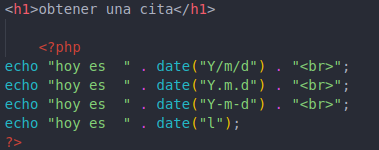

# funciones_avanzadas
#
## La función Fecha() de PHP
#
## obtener una cita
#
### La función date() se utiliza para formatear fechas y horas. Los caracteres comunes utilizados son:

### "d" para el día del mes (01 a 31).
### "m" para el mes (01 a 12).
### "Y" para el año en cuatro dígitos.
### "l" para el día de la semana.
### Otros caracteres como "/", ".", o "-" pueden insertarse para agregar formato adicional. El texto no proporciona ejemplos concretos, pero menciona que se pueden formatear fechas de diferentes maneras.

